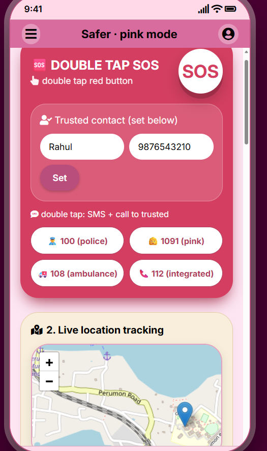
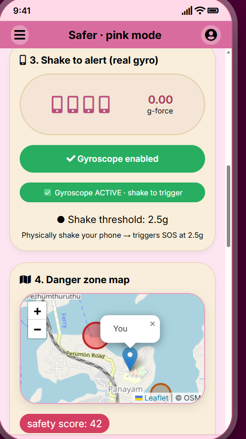
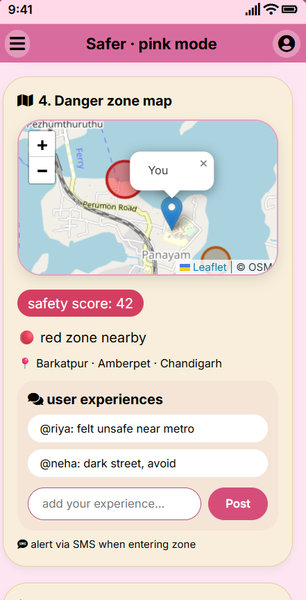

<p align="center">
  
</p>

# SHEshe-ild 🎯

## Basic Details

### Team Name: TechDivas

### Team Members
- Member 1: Angel s.m - College of Engineering Perumon
- Member 2: Binila Babu -  College of Engineering Perumon

### Hosted Project Link
https://binilababu.github.io/SHE-ld/

### Project Description
it's a software for women safety , provides offline sos,danger zone map, shake alert system,if yor are in danger ,you can contact neraby trusted users.

### The Problem statement
women faces unsafe situations daily, and poor network access makes many apps unreliable.

### The Solution
our app ensures safety through offline-first sos, live tracking and community alerts.

---

## Technical Details

### Technologies/Components Used

**For Software:**
- Languages used:  html,css,JavaScript
- Tools used:  VS Code, Git

**For Hardware:**
- Main components: [List main components]
- Specifications: [Technical specifications]
- Tools required: [List tools needed]

---

## Features

List the key features of your project:
- SOS : BY DOUBLE TAP sends sms of live location to the contact sends and gives alert calls to the saved contact and other officals like police.
- Live location tracking : shares live location and continue tracking 
- shake to alert:shake phone 3 times to trigger sos
- danger zone map: shows danger zone if any in neraby places, users can comment on the places others can see their comments.
- fake call: by tapping fake call it displays calling interface of anyone you sets(mom,police....)
- stay safe : provides details of trusted hotels and homestays.
- nearby trusted users : can message or call any trusted users by their user id showing on their screen

---

## Implementation

### For Software:

#### Installation
```bash
[Installation commands - e.g., npm install, pip install -r requirements.txt]
```

#### Run
```bash
[Run commands - e.g., npm start, python app.py]
```


### For Software:

#### Screenshots (Add at least 3)

!<p align ="center">
  
</p>
shows sos with emergency contacts and live map with sharable link

!<p align ="center">
  
</p>
shows shake to alert system and when the mobile is shaked 3 times sos triggers to the emergency contacts.

!<p align ="center">
  
</p>
shows danger zone in nearby areas and others experience and user can post thier own experience


## Project Demo

### Video
[click the link to watch the demo vedio](https://drive.google.com/file/d/1GhjNGESQXPhxhD2D-0JesLg0ufY3B9L_/view?usp=sharing)

*Explain what the video demonstrates - key features, user flow, technical highlights*


## Team Contributions

- Binila Babu: Frontend development, API integration
- angel s.m: , UI/UX design, Testing, Documentation


Made with ❤️ at TinkerHub
